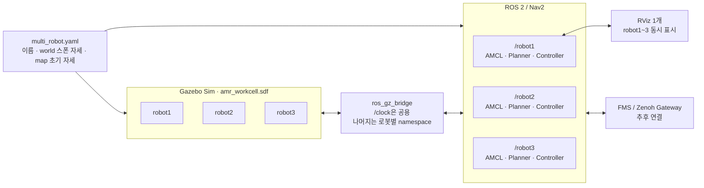

# Gazebo 멀티로봇 + Nav2 + RViz 구성

## 한 줄 요약

Gazebo에는 로봇 3대를 한 번만 띄우고, ROS 2에서는 로봇마다 namespace가 다른 Nav2를 하나씩 실행한다. RViz는 한 창만 열어 세 로봇을 함께 표시한다.

## 전체 구조



## `multi_robot_navigation2.launch.py` 함수 설명

### 함수 정의만 있는데 어떻게 실행되는가?

일반 Python 프로그램은 흔히 아래처럼 직접 진입점을 호출한다.

```python
if __name__ == '__main__':
    main()
```

ROS 2 Python launch 파일은 실행 방식이 다르다. `ros2 launch`가 파일을 읽은
뒤, 약속된 이름인 `generate_launch_description()`을 자동으로 찾아 호출한다.
따라서 파일 마지막에 이 함수를 직접 호출하는 코드가 없어도 된다.

정확한 용어는 다음과 같다.

- `def ...`: 함수 **정의**
- `some_function()`: 함수 **호출**
- `generate_launch_description()`: ROS 2 launch 파일의 **진입점(entry point)**
- 여기서는 함수를 “초기화한다”기보다 “정의하고 호출한다”고 표현한다.

`generate_launch_description()`이 반환하는 `LaunchDescription`에는 실행할 노드,
런치 인자뿐 아니라 `OpaqueFunction(function=_launch_setup)`도 들어 있다.
이 액션이 실행되는 시점에 launch 시스템이 `_launch_setup(context)`을 호출한다.
`context`가 생긴 뒤 호출하므로 `LaunchConfiguration`의 실제 값을 읽을 수 있다.

```text
ros2 launch
    ↓ 자동 호출
generate_launch_description()
    ↓ LaunchDescription 안에 등록
OpaqueFunction(function=_launch_setup)
    ↓ launch 실행 시 호출
_launch_setup(context)
    ├── 로봇 설정 읽기
    ├── 로봇별 Nav2 파라미터 생성
    ├── Gazebo·TF 집계기 준비
    ├── readiness checker 준비
    └── 순차 실행 이벤트 등록
```

즉, 일부 보조 함수는 코드에 `함수명()` 형태가 바로 보이지 않아도
`OpaqueFunction`, `OnProcessExit`, `OnShutdown`에 **콜백(callback)** 으로
등록되어 나중에 launch 시스템이 호출한다.

### 각 함수의 역할

| 함수 | 호출되는 시점 | 역할 |
|---|---|---|
| `_load_robots(config_path)` | `_launch_setup()` 실행 중 | `multi_robot.yaml`을 읽고 로봇 목록, 이름 중복, `initial_pose_map` 필수값을 검사한다. |
| `_read_pgm_size(image_path)` | 지도 범위 검사 중 | PGM 헤더에서 지도 이미지의 가로·세로 픽셀 수를 읽는다. |
| `_validate_initial_poses_in_map(...)` | `_launch_setup()` 실행 중 | 각 `initial_pose_map`이 실제 지도 범위 안에 있는지 검사하고, 범위를 벗어나면 Nav2 시작 전에 오류를 낸다. |
| `_set_parameter(...)` | `_write_robot_params()` 실행 중 | 중첩된 Nav2 YAML에서 특정 파라미터 하나를 변경하는 공통 도우미다. |
| `_write_robot_params(source_path, robot)` | `_launch_setup()`에서 로봇마다 한 번 | 기본 `burger.yaml`을 복사해 `robotN/odom`, `robotN/base_link`, AMCL 초기 위치 등을 반영한 임시 파라미터 파일을 만든다. |
| `_cleanup_temp_files(...)` | launch 종료 시 `OnShutdown`이 호출 | 실행 중 생성했던 로봇별 임시 Nav2 YAML 파일을 삭제한다. |
| `_continue_or_shutdown(...)` | readiness checker 종료 시 | checker가 성공하면 다음 로봇 단계로 진행하고, 실패하면 전체 launch를 종료한다. |
| `_make_checker(robot_name, mode, timeout)` | `_launch_setup()` 실행 중 | 센서 토픽 또는 Nav2 ACTIVE 상태를 확인할 `readiness_checker.py` 노드 정의를 만든다. 이 함수 자체가 검사하는 것은 아니다. |
| `_launch_setup(context)` | `OpaqueFunction` 실행 시 | 설정값이 확정된 뒤 전체 실행 구조를 조립하는 핵심 함수다. Gazebo, TF 집계기, 로봇별 Nav2, RViz 및 순차 기동 이벤트를 구성한다. |
| `generate_launch_description()` | `ros2 launch`가 최초로 자동 호출 | launch 인자들의 기본값을 선언하고 `_launch_setup()`을 실행할 `OpaqueFunction`을 등록한다. |

### 함수 호출 관계

```text
generate_launch_description()
└── [등록] _launch_setup(context)
    ├── _load_robots()
    ├── _validate_initial_poses_in_map()
    │   └── _read_pgm_size()
    ├── 로봇마다 _write_robot_params()
    │   └── 여러 번 _set_parameter()
    ├── 로봇마다 _make_checker(topics)
    ├── 로봇마다 _make_checker(nav2)
    ├── [이벤트 콜백] _continue_or_shutdown()
    └── [종료 콜백] _cleanup_temp_files()
```

함수 이름 앞의 `_`는 “이 파일 내부에서 사용하는 보조 함수”라는 Python
관례다. 접근을 기술적으로 금지하는 문법은 아니다.

## 준비 상태 기반 순차 기동

### 이 방식의 이름

현재 구조는 **readiness-gated, event-driven sequential startup**이다. 쉽게
말하면 “실제 준비 완료를 확인한 뒤 다음 단계를 여는 이벤트 기반 순차
기동”이다. Nav2 Lifecycle 상태도 확인하므로 **lifecycle-aware startup**이라고도
설명할 수 있다.

### 기존 타이머 방식과 비교

| 구분 | 타이머 기반 | 현재 이벤트 기반 |
|---|---|---|
| 다음 단계 조건 | 지정한 시간이 지남 | 실제 준비 조건을 만족함 |
| 예 | “5초 후 robot2 실행” | “robot1 Nav2 ACTIVE 후 robot2 실행” |
| PC가 느릴 때 | 준비 전에 다음 단계가 시작될 수 있음 | 준비될 때까지 checker가 기다림 |
| PC가 빠를 때 | 필요 없이 남은 시간을 기다림 | 준비되는 즉시 다음 단계로 진행 |
| 실패 처리 | 시간이 지나면 실패를 놓칠 수 있음 | timeout과 종료 코드로 전체 실행을 중단 |
| 유지보수 | 로봇 수나 PC 성능에 따라 시간을 재조정 | 확인할 준비 조건을 관리 |

타이머 기반 launch는 보통 `TimerAction(period=5.0, ...)`처럼 구현한다. 하지만
“5초가 지났다”는 것은 “센서와 Nav2가 정상이다”라는 증거가 아니다. 현재
구조는 시간 대신 토픽 수신과 Lifecycle Manager의 응답을 증거로 사용한다.

### readiness checker가 확인하는 것

`readiness_checker.py`는 두 가지 모드로 실행된다.

```text
topics 모드
└── 해당 로봇의 odom과 scan 메시지가 실제로 들어왔는지 확인

nav2 모드
├── lifecycle_manager_localization/is_active == true
└── lifecycle_manager_navigation/is_active == true
```

`nav2` 모드의 두 조건이 모두 참이면 checker 프로세스는 종료 코드 `0`으로
끝난다. timeout이나 오류가 발생하면 `0`이 아닌 코드로 끝난다. 즉, checker의
종료 코드는 다음 단계로 진행해도 되는지를 나타내는 신호다.

### `OnProcessExit`의 동작

핵심 코드는 다음 형태다.

```python
OnProcessExit(
    target_action=checker,
    on_exit=lambda event, context: _continue_or_shutdown(...),
)
```

- `target_action=checker`: 어떤 프로세스가 끝나는 것을 감시할지 지정한다.
- `on_exit=...`: 그 checker가 끝났을 때 실행할 콜백을 등록한다.
- `event.returncode`: checker가 성공(`0`)했는지 실패(0이 아님)했는지 알려준다.
- `_continue_or_shutdown(...)`: 성공이면 다음 로봇을 시작하고, 실패면 전체
  launch에 `Shutdown` 이벤트를 보낸다.

중요한 점은 `OnProcessExit`가 Nav2의 ACTIVE 상태를 직접 감지하는 것은
아니라는 것이다. ACTIVE 상태는 checker가 확인한다. `OnProcessExit`는 그
결과를 담은 checker 프로세스의 종료를 감지해 다음 동작을 연결한다.

```text
robot1 Nav2 시작
    ↓
robot1 checker가 ACTIVE 여부 반복 확인
    ↓ ACTIVE 확인 후 종료 코드 0
OnProcessExit가 checker 종료 감지
    ↓
_continue_or_shutdown()이 robot2 Nav2 시작
```

같은 연결이 robot2와 robot3에도 등록되어 최종적으로 다음 체인이 만들어진다.

```text
robot1~3 odom/scan 준비 확인
    ↓
robot1 Nav2 ACTIVE
    ↓
robot2 Nav2 ACTIVE
    ↓
robot3 Nav2 ACTIVE
    ↓
RViz 실행
```

## 왜 이 구조인가?

### 1. 로봇 설정을 한 파일에서 관리

로봇 이름과 두 좌표계의 시작 위치는 `multi_robot.yaml` 하나에서 관리한다.
파일은 하나지만 좌표의 의미는 명확하게 분리한다.

```yaml
robots:
  - name: robot1
    spawn_pose_world:
      x: 2.48
      y: -1.27
      z: 0.01
      yaw: 0.0
    initial_pose_map:
      x: 0.0
      y: 0.0
      z: 0.0
      yaw: 0.0
```

```text
spawn_pose_world
└── Gazebo world 기준 로봇 생성 위치

initial_pose_map
└── 저장된 지도에서 AMCL이 사용할 초기 위치
```

Gazebo 런처는 `spawn_pose_world`만 읽고 Nav2 런처는
`initial_pose_map`만 읽는다. 이 둘은 물리적으로 같은 로봇 위치를 표현할 수
있지만 좌표계가 다르므로 숫자가 같을 필요가 없다.

현재 지도는 robot1이 Gazebo world `(2.48, -1.27)` 부근에서 SLAM을 시작해 그
위치가 map `(0, 0)` 부근이 된 지도다. 따라서 현재 초기값은 다음 관계를
사용한다.

```text
robot1 map ≈ (0.00, 0.00)
robot2 map ≈ (0.00, 1.25)
robot3 map ≈ (0.00, 2.51)
```

Nav2 런처는 지도 YAML의 `origin`, `resolution`과 PGM 크기로 지도 범위를
계산한다. `initial_pose_map`이 범위를 벗어나면 AMCL과 RViz를 잘못된 상태로
실행하지 않고 즉시 오류를 출력한다.

지도 YAML의 `origin`은 로봇의 초기 위치가 아니다. PGM 이미지의 왼쪽 아래
모서리가 `map` 좌표에서 어디인지 나타내는 이미지 메타데이터다. 로봇 위치를
고치기 위해 `origin`을 변경하면 지도, Route Graph와 모든 map 좌표가 함께
이동하므로 로봇별 초기 위치 문제의 해결책으로 사용하지 않는다.

### 2. ROS 토픽은 namespace로 분리

```text
/robot1/scan       /robot2/scan       /robot3/scan
/robot1/odom       /robot2/odom       /robot3/odom
/robot1/cmd_vel    /robot2/cmd_vel    /robot3/cmd_vel
/robot1/tf         /robot2/tf         /robot3/tf
```

`/clock`은 모든 로봇이 공유하고 센서·제어·TF 토픽은 로봇별 namespace로 분리한다.

### 3. 로봇별 TF를 RViz용 공용 TF로 집계

Nav2는 공식 bringup의 namespace 규칙에 맞춰 `/robotN/tf`, `/robotN/tf_static`을 사용한다. RViz 하나에서 세 좌표계를 함께 보기 위해 TF 집계기가 로봇별 TF를 공용 `/tf`, `/tf_static`으로 단방향 전달한다. frame 이름에는 로봇 이름을 붙여 충돌을 방지한다.

```text
map
├── robot1/odom → robot1/base_footprint → robot1/base_link
├── robot2/odom → robot2/base_footprint → robot2/base_link
└── robot3/odom → robot3/base_footprint → robot3/base_link
```

Nav2 파라미터의 `odom_frame_id`, `base_frame_id`, `robot_base_frame`도 각 로봇의 frame 이름과 일치시켜야 한다.

### 4. Nav2는 로봇마다 독립 실행

각 로봇은 서로 다른 Nav2 노드를 갖는다.

```text
/robot1/amcl
/robot1/planner_server
/robot1/controller_server
/robot1/bt_navigator

/robot2/amcl
/robot2/planner_server
...
```

즉, 한 로봇의 경로 계획이나 복구 동작이 다른 로봇의 Nav2 상태에 직접 영향을 주지 않는다.

기본값은 `use_composition:=true`다. 로봇마다 위 ROS 노드들을 하나의
`nav2_container` 프로세스에 묶어 프로세스 수와 DDS 자원 사용량을 줄인다.
노드 이름과 namespace는 그대로 분리되므로 세 Nav2 스택의 논리적 독립성은
유지된다.

### 5. RViz는 기본적으로 한 창만 실행

RViz 세 창을 동시에 열면 CPU와 GPU 사용량이 커진다. 그래서 RViz는 하나만
실행하고, 공통 `map`과 세 로봇의 RobotModel/TF를 동시에 표시한다. 로봇별
`/robotN/tf`, `/robotN/tf_static`은 단방향 TF 집계 노드가 RViz용 전역 `/tf`,
`/tf_static`으로 모아 준다.

## 실행 방법

### 빌드

```bash
cd /home/woozoo/dev/Logistics_AMR
source /opt/ros/jazzy/setup.bash
colcon build --packages-select turtlebot3_gazebo turtlebot3_navigation2 --symlink-install
source install/setup.bash
```

### Gazebo + 로봇 3대 + Nav2 3개 + RViz 실행

```bash
export TURTLEBOT3_MODEL=burger
ros2 launch turtlebot3_navigation2 multi_robot_navigation2.launch.py
```

### RViz 없이 실행

```bash
ros2 launch turtlebot3_navigation2 multi_robot_navigation2.launch.py \
  use_rviz:=false
```

### Gazebo는 이미 실행 중이고 Nav2만 실행

```bash
ros2 launch turtlebot3_navigation2 multi_robot_navigation2.launch.py \
  use_simulator:=false
```

### Gazebo GUI 없이 실행

```bash
ros2 launch turtlebot3_navigation2 multi_robot_navigation2.launch.py \
  gui:=false
```

### 실행 중간 점검 및 공유 항목

전체 로그를 모두 복사할 필요는 없다. 팀 내부 점검이나 문제 공유 시 다음
정보면 현재 단계와 실패 지점을 판단할 수 있다.

1. 아래 준비 로그가 어느 단계까지 출력됐는지 공유한다.

   ```text
   robot1 topics: ready
   robot2 topics: ready
   robot3 topics: ready
   robot1 Nav2: ready
   robot2 Nav2: ready
   robot3 Nav2: ready
   ```

2. `ERROR`가 있으면 첫 번째 `ERROR`와 그 앞뒤 로그 약 20줄을 공유한다. 종료
   과정에서만 발생한 메시지보다, 최초 오류가 원인 분석에 더 중요하다.

3. Gazebo와 RViz에서 세 로봇이 보이는 화면을 각각 한 장씩 공유한다.

4. 별도 터미널에서 다음 결과를 공유한다.

   ```bash
   ros2 action list | grep navigate_to_pose
   ros2 lifecycle get /robot1/controller_server
   ros2 lifecycle get /robot2/controller_server
   ros2 lifecycle get /robot3/controller_server
   ```

기대 결과는 로봇별 `navigate_to_pose` 액션 세 개와 각 controller server의
`active [3]` 상태다. 문제가 없다면 다음 점검은 robot1에 안전한 목표 좌표를
하나 보내 실제 이동과 `/robot1/cmd_vel` 출력을 확인하는 것이다.

## RViz에서 주행시키기

1. RViz의 Fixed Frame이 `map`인지 확인한다.
2. 지도와 robot1~3 RobotModel/TF가 표시되는지 확인한다.
3. AMCL 초기 위치는 `multi_robot.yaml`의 `initial_pose_map`으로 자동 설정된다.
4. LaserScan이 지도 벽면과 겹치는지 확인한다. 약간 어긋나면 map 기준 초기
   자세를 보정해야 하며 Gazebo `spawn_pose_world`를 변경할 필요는 없다.

RViz를 실행하면 다음 LaserScan display가 자동으로 활성화된다.

```text
Robot1 Scan: /robot1/scan  빨간색
Robot2 Scan: /robot2/scan  초록색
Robot3 Scan: /robot3/scan  파란색
```

상단 도구 모음의 `Publish Point`는 클릭한 map 좌표를 `/clicked_point`에
`geometry_msgs/PointStamped`로 발행한다. 좌표 확인에는 적합하지만 방향 정보가
없으므로 Nav2 주행 목표로 직접 사용하지는 않는다.

```bash
ros2 topic echo /clicked_point
```

현재 RViz 설정은 **세 로봇 표시와 TF 검증**까지 자동 구성한다. 표준 RViz의
`Nav2 Goal` 도구 하나는 로봇 namespace를 자동 선택하지 못하므로 아직 넣지
않았다. 다음 단계에서 로봇 선택기/goal dispatcher를 추가하거나, 우선
`/robotN/navigate_to_pose` 액션을 직접 호출해 로봇별 주행을 검증한다.

## Goal Dispatcher 설계 검토

한 RViz에서 사용자가 로봇을 선택하고 목표 자세를 지정하려면 경량 Goal
Dispatcher를 두는 것이 현재 단계에 적합하다.

```text
RViz 2D Goal Pose
        │ PoseStamped: x, y, yaw, frame=map
        ▼
Multi-Robot Goal Dispatcher
        │ 선택된 robot 이름 확인
        ├── robot1 → /robot1/navigate_to_pose
        ├── robot2 → /robot2/navigate_to_pose
        └── robot3 → /robot3/navigate_to_pose
```

`Publish Point`는 `x, y`만 제공하므로 좌표 확인용으로 유지한다. Dispatcher의
주행 목표 입력에는 화살표로 방향까지 지정하는 `2D Goal Pose`와
`geometry_msgs/PoseStamped`를 사용한다.

구현 시 다음 안전 조건을 둔다.

- 로봇이 명시적으로 선택되지 않으면 Goal을 거부한다.
- `robots_file`에 없는 로봇 이름은 거부한다.
- Goal의 `frame_id`는 `map`인지 검사한다.
- 해당 로봇의 NavigateToPose action server가 준비됐는지 확인한다.
- 로봇별 Goal 진행·성공·실패·취소 상태를 구분해서 발행한다.
- 한 로봇의 Goal을 다른 로봇에 broadcast하지 않는다.

다른 선택지는 로봇별 Action을 터미널에서 직접 호출하거나 RViz를 로봇마다
따로 실행하는 것이다. 직접 Action 호출은 검증에는 가장 단순하지만 반복
운영이 불편하고, RViz 3개는 자원 사용량과 화면 관리 비용이 크다. 따라서
현재 수동 멀티로봇 테스트에는 Dispatcher가 적합하다.

단, 이 Dispatcher는 사람이 RViz에서 테스트하기 위한 입력 어댑터다. 최종
FMS에서는 Fleet Manager가 각 `/robotN/navigate_to_pose` 또는 Route action을
직접 선택해 호출하며, 교통·작업 할당 로직을 RViz Dispatcher 안에 넣지 않는다.

## 주요 파일

| 파일 | 역할 |
|---|---|
| `turtlebot3_gazebo/params/multi_robot.yaml` | 로봇 목록, `spawn_pose_world`, `initial_pose_map`의 단일 관리 지점 |
| `turtlebot3_gazebo/launch/multi_robot_workcell.launch.py` | Gazebo, robot_state_publisher, ros_gz_bridge 실행 |
| `turtlebot3_navigation2/launch/multi_robot_navigation2.launch.py` | Nav2 3개와 RViz 실행을 총괄 |
| `turtlebot3_navigation2/param/burger.yaml` | Nav2 동작 파라미터 |
| `turtlebot3_navigation2/map/amr_workcell.yaml` | AMCL과 planner가 사용하는 공용 지도 |

## FMS / Zenoh 연결 위치

Nav2까지 정상 동작하면 FMS Gateway는 다음 경계에 연결한다.

```text
Zenoh robot1/goal
        ↓
/robot1/navigate_to_pose 액션

/robot1/odom + Nav2 상태
        ↓
Zenoh robot1/telemetry
```

Gazebo와 Nav2는 실제 로봇과 동일한 ROS 인터페이스를 제공하고, Gateway만 시뮬레이션과 실제 AMR에서 공통으로 사용한다.

## 확인 명령

```bash
ros2 node list | grep robot
ros2 topic list | grep robot
ros2 action list | grep navigate_to_pose
ros2 topic hz /robot1/scan
ros2 topic hz /robot1/odom
```

예상되는 핵심 액션은 다음과 같다.

```text
/robot1/navigate_to_pose
/robot2/navigate_to_pose
/robot3/navigate_to_pose
```
