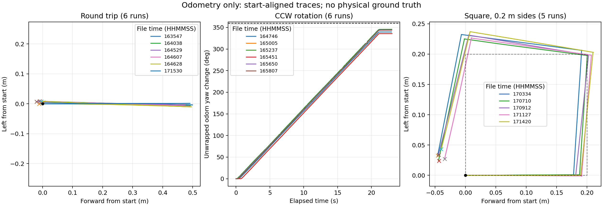

# TurtleBot3 Odom 실험 분석 (2026-09-16)

## 범위와 계산

원본 폴더: `/home/heeyeon/turtlebot3_odom_drift_results`.
Summary 18개, 대응 trace 18개, RViz 캡처 10개(round 5개, square 5개)를 확인했다. 실측 오차는 포함하지 않는다. 원본은 변경하지 않았다.

위치 차이는 Odom 시작·종료 좌표의 유클리드 거리, 방향 차이는 시작·종료 yaw 차이를 ±180도로 환산한 값이다. 평균 및 표본 표준편차(ddof=1)를 계산했다. 누적 각도는 trace의 연속 yaw를 unwrap하여 확인했다. 그래프는 각 실행의 시작 좌표를 원점으로 이동하고 시작 방향을 +X로 회전 정렬했다. 사각형 점선은 한 변 0.2m의 명목 경로이며 실제 정답 궤적은 아니다.

## 집계

| 실험 | 횟수 | 위치 차이 평균 ± 표준편차 (mm) | 위치 범위 (mm) | 방향 차이 평균 ± 표준편차 (도) | 평균 절대 방향 차이 (도) |
|---|---:|---:|---:|---:|---:|
| 왕복 0.5m 전진/후진 | 6 | 12.51 ± 5.43 | 5.47~21.64 | -1.27 ± 0.72 | 1.30 |
| 반시계 360도 회전 | 6 | 0.83 ± 0.40 | 0.41~1.40 | -17.95 ± 3.78 | 17.95 |
| 한 변 0.2m 사각형 | 5 | 53.03 ± 6.11 | 43.91~59.22 | -16.25 ± 1.19 | 16.25 |

왕복과 회전은 각각 6개 기록을 포함했다. 캡처가 5개라는 이유로 임의의 기록을 골라 5회 평균을 만들지 않았다. 정식 5회 세트가 별도로 지정되면 집계 대상을 명시하여 다시 계산해야 한다.

## 실행별 수치

| 파일 시각 | 종류 | 위치 차이 (mm) | 방향 차이 (도) |
|---|---|---:|---:|
| 16:35:47 | 왕복 | 5.470 | -1.219 |
| 16:40:38 | 왕복 | 12.936 | -1.869 |
| 16:45:29 | 왕복 | 21.638 | -1.213 |
| 16:46:07 | 왕복 | 14.198 | -1.592 |
| 16:46:28 | 왕복 | 9.281 | -1.812 |
| 17:15:30 | 왕복 | 11.544 | +0.091 |
| 16:47:46 | 회전 | 1.402 | -20.623 |
| 16:50:05 | 회전 | 0.562 | -16.325 |
| 16:52:37 | 회전 | 0.715 | -14.383 |
| 16:54:51 | 회전 | 0.645 | -24.350 |
| 16:56:50 | 회전 | 0.409 | -15.630 |
| 16:58:07 | 회전 | 1.236 | -16.391 |
| 17:03:34 | 사각형 | 56.413 | -14.717 |
| 17:07:10 | 사각형 | 49.935 | -15.373 |
| 17:09:12 | 사각형 | 55.664 | -17.342 |
| 17:11:27 | 사각형 | 43.906 | -16.420 |
| 17:14:20 | 사각형 | 59.215 | -17.416 |

## 해석

왕복은 전진과 후진 궤적이 거의 겹치지만 종료점은 5.47~21.64mm 떨어져 있다. 따라서 캡처에서 한 줄처럼 보인다고 복귀 차이가 없는 것은 아니다.

회전 6회의 unwrap된 누적 Odom 회전량은 335.65~345.62도(평균 342.05도)였다. 모든 실행에서 명목 360도에 못 미치는 일관된 방향 차이가 나타난다. 실제 회전량을 측정하지 않았으므로 시간 기반 구동의 회전 부족과 오도메트리 추정 편향을 분리할 수 없다. 이 결과만으로 IMU 또는 바퀴 보정값을 결정해서는 안 된다.

사각형은 5회 모두 비슷하게 기울어진 열린 사각형으로 나타난다. RViz square1~5 캡처에서도 이 형태가 반복된다. 출발 정렬 trace에서 종료점은 대체로 뒤쪽·왼쪽에 모인다. 직진·회전·정지를 합친 각 변 주기의 방향 변화는 약 83.38~87.19도이며, 명목 90도보다 작게 변하는 경향이 전체 형태와 일치한다. 이는 순수 회전 단계만의 각도 통계는 아니다.

사각형의 평균 위치 차이는 왕복 평균의 약 4.24배다. 이동 거리와 회전 횟수가 다른 실험이므로 동일 조건 성능비로 해석하지 않는다. 명목 이동거리 0.8m로 나눈 사각형 복귀 차이 비율은 평균 6.63%이며, 실제 주행거리 기반 드리프트율이 아니다.

## 캡처 및 데이터 품질

- round1~5는 전후진 궤적이 가깝게 겹치고, square1~5는 끝이 닫히지 않은 사각형이다. 회전 캡처는 폴더에 없다.
- 캡처마다 맵의 화면상 위치·크기가 다르고 축척 표기와 시작·종료 식별자가 없다. 픽셀 거리로 정량 비교하지 않고 CSV를 수치 근거로 사용했다.
- 이미지 파일 이름에 CSV 시각이 없으므로 round1 등을 특정 CSV에 확정 연결하지 않았다. square 캡처는 수정시각상 각 실행과 대응하는 것으로 보이지만 파일명 자체로 확인되지는 않는다.
- `20260916_153810_round_trip`은 별도 분류했다. 위치 차이 111.784mm, 방향 차이 -7.758도이며, trace에 인접 표본 사이 최대 약 496.26mm 좌표 점프가 있다. 12.10초에 1196표본으로 후속 왕복(약 14.1초, 282~284표본)과 기록 특성도 다르다. 중복 발행·리셋 등 원인은 이 자료만으로 확정할 수 없다. 이 파일을 포함한 왕복 전체 7회의 위치 차이 평균은 약 26.69mm다.
- 모든 trace 행 수가 summary의 sample_count와 일치했다. trace 최종 좌표에서 다시 계산한 위치 차이는 CSV 반올림 수준(0.002mm 미만)에서 summary와 일치했다.
- 후속 기록 일부에 최대 0.417초의 표본 간격이 있다. 고주파 속도·가속도 분석에는 이를 고려해야 한다.

## 결론

Odom 기준 복귀 위치 차이는 왕복 평균 1.25cm, 사각형 평균 5.30cm다. 회전과 사각형에서 음의 방향 차이가 반복되는 것이 가장 뚜렷한 관찰이다. 유효 집계 17회 모두 Odom 위치 차이는 0.1m 미만이지만, 실측 기반 위치 정확도 0.1m 달성 여부나 순수 센서 드리프트를 판단할 수는 없다. Nav2 목표 허용오차는 현재 시간 기반 자동 실험의 종료 조건에 사용되지 않는다.

